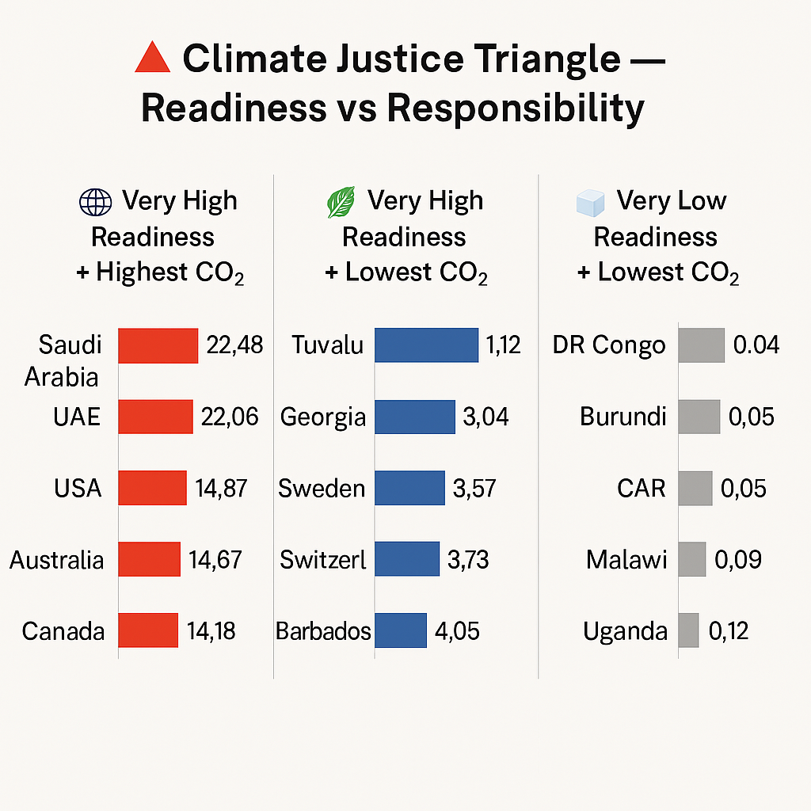

# 🌍 GelecekHayalim – W-Code 2.0: Climate Readiness Inequality  
📊 Making Global Readiness Inequalities Visible Through Data  
Project by Zeliha Güven

---

## 🇹🇷 Proje Hakkında  
İklim krizi tüm gezegeni etkiliyor—fakat eşit değil. Tarihsel olarak en az karbon salımı yapan ülkeler, en çok zarar görenler. Bu proje, “En az sorumlu olanlar en yüksek bedeli ödüyor” mesajını veri ve görselleştirmelerle ortaya koyuyor.

ND-GAIN, OWID ve World Bank verileriyle ülkelerin iklim hazırlık skorları, çevresel kırılganlıkları ve sosyoekonomik dirençleri analiz edildi. Amaç, eşitsizlikleri göstermek ve iklim adaletine destek olmaktır.

---

## 🇬🇧 About the Project  
The climate crisis affects the planet unevenly. Countries contributing least often suffer most. This project highlights “Those least responsible pay the highest price” using open data from ND-GAIN, OWID, and World Bank. It reveals disparities and supports climate justice.

---

## 🛠️ Nasıl Çalıştırılır / How to Run  

### 🇹🇷  
1. Gerekli kütüphaneleri yükleyin:  
pip install pandas numpy matplotlib seaborn plotly scikit-learn xgboost geopandas

2. Jupyter Notebook'u başlatın:  
3. Aşağıdaki dosyaları sırayla çalıştırın:  
- `merge_climate_data.ipynb` – Veri birleştirme ve temizleme  
- `analysis.ipynb` – Görselleştirme ve analiz  
- `model.ipynb` – Readiness tahmini (XGBoost)

### 🇬🇧  
1. Install required libraries:  
pip install pandas numpy matplotlib seaborn plotly scikit-learn xgboost geopandas

2. Launch Jupyter Notebook:  
3. Run notebooks in order:  
- `merge_climate_data.ipynb` – Merging and cleaning data  
- `analysis.ipynb` – Visualization and inequality analysis  
- `model.ipynb` – Predicting readiness with XGBoost

---

Veri Kaynakları / Data Sources
ND-GAIN: https://gain.nd.edu

Our World in Data (OWID): https://ourworldindata.org

World Bank Open Data: https://data.worldbank.org
## 📊 Analiz Özeti / Analysis Summary  

## 📊 İklim Adaleti Üçgeni Görselleştirmesi //  Climate Readiness Analysis

## 📊 Analiz Özeti / Analysis Summary  

### 🇹🇷  
Hazırlık skorları ile kişi başı CO₂ emisyonları karşılaştırıldı. En çok salım yapan ülkeler en hazırlıklı, düşük salımlılar ise en kırılgan durumda. Bu adaletsizlik “İklim Adaleti Üçgeni” görseliyle sunuldu.

### 🇬🇧  
Readiness scores were compared with per capita CO₂ emissions. High emitters are most prepared; low emitters are most vulnerable. Visualized via the “Climate Justice Triangle.”

---

## 📈 Modelleme ve Eksik Veri Tahmini / Modeling & Missing Data Imputation  

### 🇹🇷  
Eksik veriler XGBoost ile başarıyla tahmin edilip tamamlandı. Readiness skorları için XGBoost regresyon modeli %99’a yakın doğruluk sağladı. Model, önemli etkenleri (health, person_gdp, economic) ortaya koydu.

### 🇬🇧  
Missing data were imputed using XGBoost. The readiness prediction model achieved ~99% accuracy. Key drivers identified: health, person_gdp, and economic factors.

---

## 🌍 Sonuçlar: Hazır Olanlar, Sorumlu Olanlar ve Geride Kalanlar / The Ready, the Responsible, and the Left Behind  

### 🇹🇷  
Ülkeler, hazırlık ve kişi başı CO₂ emisyonlarına göre gruplandı:  
* **Yüksek Hazırlık + Yüksek Emisyon:** ABD, Suudi Arabistan, Avustralya  
* **Yüksek Hazırlık + Düşük Emisyon:** Tuvalu, İsveç, Barbados  
* **Düşük Hazırlık + Düşük Emisyon:** Burundi, Uganda, Malavi  

Bu, iklim adaletindeki eşitsizliği gösteriyor. Ancak topluluk odaklı ve sürdürülebilir yaklaşımlar umut veriyor.  

### 🇬🇧  
Countries grouped by readiness and per capita CO₂ emissions:  
* **High Readiness + High Emissions:** USA, Saudi Arabia, Australia  
* **High Readiness + Low Emissions:** Tuvalu, Sweden, Barbados  
* **Low Readiness + Low Emissions:** Burundi, Uganda, Malawi  

This highlights climate justice disparities, yet community-focused, sustainable approaches offer hope.

---

---

## 📬 İletişim / Contact

Zeliha Güven  
Email: zelihguven@gmail.com  
LinkedIn: [linkedin.com/in/zeliha-guven](https://www.linkedin.com/in/zeliha-guven)
